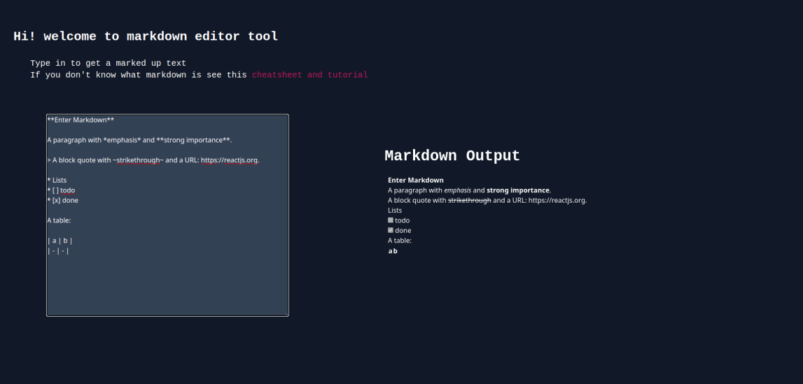

# markdowneditor
markdown editor is built in react using [react-markdown](https://github.com/remarkjs/react-markdown) package\
vite is used for tooling

wrote a useLocalStorage hook to sustain the markdown through sessions 

to run this locally, clone the repo and run: `npm run dev`

- [See Live](https://kn-oz.github.io/MarkdownEditor/)

